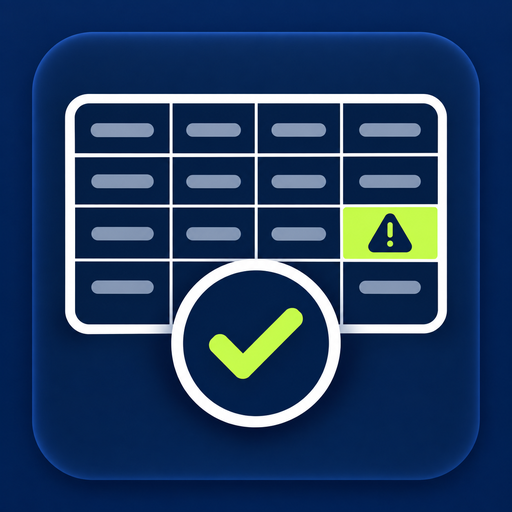

# Product Catalog Quality Checker — CSV, SKU & Prices



Supply CSV text or product records and get per-record validation issues, normalized values and preserved originals.

**[Open the Actor on Apify](https://apify.com/abdulwhab95/catalog-product-data-quality-checker) · [All tools](../../README.md) · فحص جودة الكتالوج**

## Try it without code

Open the Actor, sign in to Apify, paste the JSON below into the input editor and review the current price before running. Download results from the run's Dataset as JSON or CSV.

The small example uses public source data (or an explicitly synthetic fixture). For your own workflow, substitute a source you are permitted to access. A source appearing in a demo is not an endorsement.

## Example input

```json
{
  "records": [
    {
      "Name": "Example",
      "SKU": "A",
      "Regular price": "12",
      "Sale price": "9"
    }
  ],
  "columnPreset": "woocommerce",
  "maxResults": 1,
  "delimiter": ",",
  "decimalSeparator": ".",
  "maxRequests": 100
}
```

## Run with Python

From the repository root, after setting your own `APIFY_TOKEN` ([setup](../../README.md#run-an-example)):

```sh
python run.py catalog-product-data-quality-checker
```

This starts one paid Actor run with a default $0.10 pay-per-event charge ceiling and a 180-second Actor timeout. That parameter does not cap every pricing model; review current pricing first. See the root README for billing and timeout details. Results are saved under `results/`.

## Actual output excerpt

Verified 2026-09-23T21:53:28.005Z UTC, build `1.0.7`, run `iQeAgPTtNNLXCm0Th`. 1 rows returned. This is a small functional check, not a completeness or availability guarantee. Selected fields only; no values are fabricated. See [JSON excerpt](sample-output.json).

| rowNumber | status | issueCodes |
| --- | --- | --- |
| 1 | PASS |  |

## Limits and pricing

Diagnostic only: it does not repair your source catalog or certify compatibility with a store importer. The demo uses synthetic records.

The Actor and source may change after this sample. Refer to the [current Store listing](https://apify.com/abdulwhab95/catalog-product-data-quality-checker) for full input options and pricing, including any start fee. An Apify token is required for API use even where no source-site API key is required.

Published by the tool's developer. Source names identify compatibility and data provenance, not endorsement. You are responsible for permitted use and source attribution. Sample third-party data retains its original rights.
