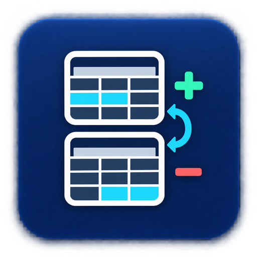

# Dataset Change Detector — Prices, Stock & Records



Supply previous and current JSON snapshots and get NEW, UPDATED or optional REMOVED events with before/after values.

**[Open the Actor on Apify](https://apify.com/abdulwhab95/dataset-change-detector) · [All tools](../../README.md) · مقارنة البيانات**

## Try it without code

Open the Actor, sign in to Apify, paste the JSON below into the input editor and review the current price before running. Download results from the run's Dataset as JSON or CSV.

The small example uses public source data (or an explicitly synthetic fixture). For your own workflow, substitute a source you are permitted to access. A source appearing in a demo is not an endorsement.

## Example input

```json
{
  "previous": [
    {
      "id": "SKU-1",
      "price": 10,
      "inStock": true
    },
    {
      "id": "SKU-2",
      "price": 5
    }
  ],
  "current": [
    {
      "id": "SKU-1",
      "price": 12,
      "inStock": false
    },
    {
      "id": "SKU-3",
      "price": 8
    }
  ],
  "keyFields": [
    "id"
  ],
  "allowRemoved": true,
  "maxResults": 3,
  "currentSnapshotComplete": true,
  "allowEmptySnapshot": false,
  "seedBaselineOnly": false,
  "minPriceChangePercent": 0,
  "onlyPriceOrStockChanges": false,
  "priceField": "price",
  "currencyField": "currency",
  "stockFields": [
    "inStock"
  ],
  "maxRequests": 100
}
```

## Run with Python

From the repository root, after setting your own `APIFY_TOKEN` ([setup](../../README.md#run-an-example)):

```sh
python run.py dataset-change-detector
```

This starts one paid Actor run with a default $0.10 pay-per-event charge ceiling and a 180-second Actor timeout. That parameter does not cap every pricing model; review current pricing first. See the root README for billing and timeout details. Results are saved under `results/`.

## Actual output excerpt

Verified 2026-09-23T21:53:32.874Z UTC, build `1.0.7`, run `mTjsFQBqDAQrEeEnJ`. 3 rows returned. This is a small functional check, not a completeness or availability guarantee. Selected fields only; no values are fabricated. See [JSON excerpt](sample-output.json).

| event | key |
| --- | --- |
| UPDATED | {"id": "SKU-1"} |
| NEW | {"id": "SKU-3"} |

## Limits and pricing

Removal detection requires a complete current snapshot. The demo uses synthetic product records, not real store prices.

The Actor and source may change after this sample. Refer to the [current Store listing](https://apify.com/abdulwhab95/dataset-change-detector) for full input options and pricing, including any start fee. An Apify token is required for API use even where no source-site API key is required.

Published by the tool's developer. Source names identify compatibility and data provenance, not endorsement. You are responsible for permitted use and source attribution. Sample third-party data retains its original rights.
